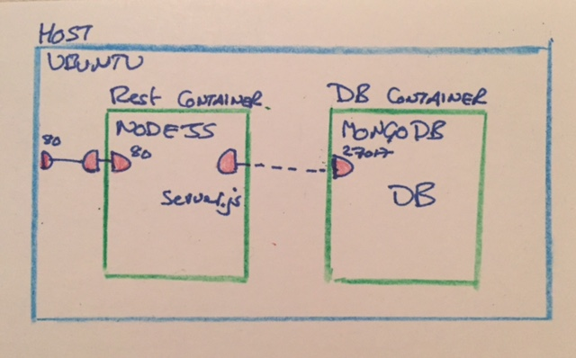
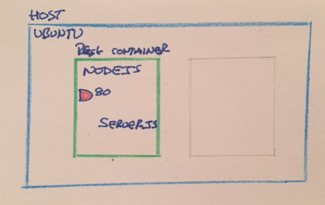
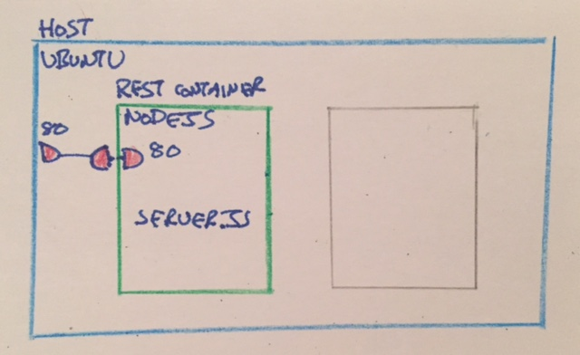
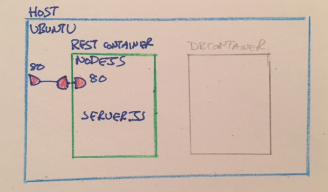
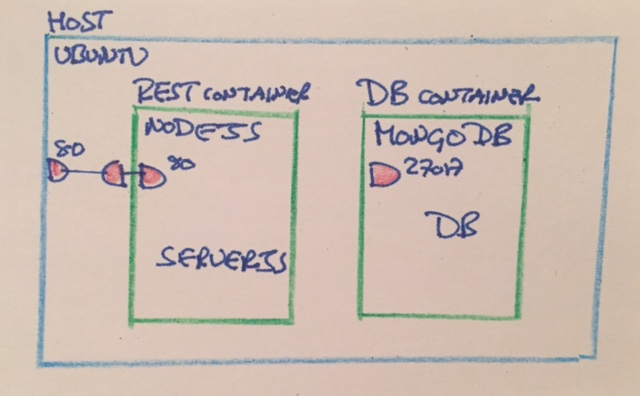

# Docker Introduction

### David Jones, October 2015

---

## Docker: the product
+ Docker: Build, Ship, Run
+ Docker is an open platform for building, shipping and running distributed applications. It gives programmers, development teams and operations engineers the common toolbox they need to take advantage of the distributed and networked nature of modern applications. (docker.com)

&nbsp;

## Docker: the open-source project
+ Docker is an open-source project that automates the deployment of applications inside software containers, by providing an additional layer of abstraction and automation of operating-system-level virtualization on Linux, Mac OS and Windows. (wikipedia)

---

## What is a container?
+ Container is a wrapper around an OS process
+ Process has its own file system, networking, and isolated process tree
+ Isolation is based on features of the Linux kernel
+ You can think of the container as a kind of sandboxed process

&nbsp;

+ Containers can also be considered as a light-weight Virtual Machine - with some caveats

---

## Why are containers interesting?
+ Fast startup time
 + Just starting a normal OS process vs starting a virtual machine with an entire OS
+ Better utilization of host machine
 + Process isolation allows low overhead separation between hosted applications
+ Container as a self-contained deployable component
 + More of an application/component level technology than virtual machine infrastructure
+ Container images are host agnostic and can be deployed anywhere
 + Large body of ready-made containers to be used
+ Fits into a DevOps centric approach
 + Specified by configuration files that can be version controlled
 + Scriptable from command line together with APIs allows it to fit into a delivery pipeline

---

## Docker Example

+ Build and run a simple Restful NodeJS application using mongodb

+ Given a clean Linux machine how could we implement a node application?
 + NodeJS + MongoDB + application node code
+ We could install nodejs and mongodb in the usual fashion (apt-get install node...)
+ Instead we will use docker

---

## Restful Application

+ Setup a Rest container that runs a server.js file using nodejs
+ Setup a DB container that runs MongoDB
+ Host and containers linked using network
+ Notice that there are two containers vs one virtual machine



---
## Create a node based restful application
+ The docker hub website contains hundreds of official repositories and 100,000+ user contributed repositories
+ Download the 'node' version 4.1 docker image from docker hub and run as a container named 'rest'

```
$ docker run -it --rm --name rest \
    node:4.1

Unable to find image 'node:4.1' locally
4.1: Pulling from library/node
116f2940b0c5: Pull complete
...
Status: Downloaded newer image for node:4.1
```
+ Download succeeded but then the docker container immediately Exited
+ No node code to run!

---

## Create a basic node application
+ Create the standard node application using express js
+ Notice that there are no docker specific changes

```
var express = require('express');
var app = express();

app.get('/api/countries', function (req, res) {
  res.send(['ca', 'us']);
});

var server = app.listen(80, function () {
  var host = server.address().address;
  var port = server.address().port;

  console.log('Example app listening at http://%s:%s', host, port);
});
```

---

## Run node application
+ Containers start isolated from the host so we will need to provide access to our code
+ Run with the `-v` volume argument to map the host file system current directory to the container's /usr/src/app directory
+ The `-w` argument sets the container's working directory to /usr/src/app

---

## Install npm dependencies
+ First we will install the expressjs and its dependencies

```
$ docker run -it --rm --name rest \
    -v $PWD:/usr/src/app -w /usr/src/app \
    node:4.1 \
    npm install

npm info it worked if it ends with ok
npm info using npm@2.14.4
npm info using node@v4.1.2
...
express@4.13.3 node_modules/express
npm info ok
```

+ This will result in a node_modules directory present on the host file system as `-v` volume is bidirectional

---

## Start server
+ To run the application

```
$ docker run -it --rm --name rest \
    -v $PWD:/usr/src/myapp -w /usr/src/myapp \
    node:4.1 \
    npm start

npm info it worked if it ends with ok
....

> rest@1.0.0 start /usr/src/myapp
> node server.js

Example app listening at http://:::80
```

+ Is the application responding to HTTP requests?

```
$ curl localhost/api/countries
curl: (7) Failed to connect to localhost port 3000: Connection refused
```

---

## Providing access to the containers port

+ Containers are self-enclosed sandbox by default
+ nodejs process within the rest container is listening on port 80
+ No access outside of the container to that port



---

## Open rest port 80 to host

+ Restart the container using the -p option to make the container's port 80 accessible to the host at port 80
+ We could map between different port numbers on the container and the host, including random host port to overcome port conflicts

```
$ docker run -it --rm --name rest \
    -p 80:80 \
    -v $PWD:/usr/src/myapp -w /usr/src/myapp \
    node:4.1 \
    npm start

Example app listening at http://:::80

$ curl localhost/api/countries
["ca","us"]
```
---

## Rest accessible from host



---

## Improving the definition of the rest container

---

## Building the rest image
+ Currently the rest container is defined by:
 + node image
 + javascript and package.json from the host filesystem
 + docker run command line
+ Building a new image that extends the node image with the javascript and package.json
+ This image could be run on any docker installation
+ Content of an image is defined in the Dockerfile
 + Limited number of Dockerfile commands
 + FROM command image to extend another image, typically terminating in a linux OS, which can differ from host OS
 + RUN allows shell commands, for example OS's package manager such as (apt-get install ...)
 + CMD set the default command when container is run

---

## Rest image Dockerfile
```
$ vi Dockerfile
FROM node:4.1.2

RUN mkdir -p /usr/src/app
WORKDIR /usr/src/app

COPY package.json /usr/src/app/
RUN npm install
COPY . /usr/src/app

CMD [ "npm", "start" ]
```
+ Notice how some of the docker run command line options we were using are now represented in this file

---

## Building the rest image

+ Most public images are created automatically from a github repository
+ We can create our own image manually using the __docker build__ command

```
$ docker build -t my-rest .

Sending build context to Docker daemon 4.096 kB
Step 0 : FROM node:4.1.2
Step 1 : RUN mkdir -p /usr/src/app
...
Step 6 : CMD npm start
Successfully built 8baaa541b2b5
```

+ We can see the new image in the local list of images

```
$ docker images

REPOSITORY                 TAG                 IMAGE ID            CREATED             VIRTUAL SIZE
my-rest                    latest              8baaa541b2b5        5 minutes ago       644.2 MB
node                       4.1                 a3157e9edc18        6 days ago          641.2 MB
```

---

## Run the my-rest image

+ Running the new my-rest image is more direct

```
$ docker run -it --rm --name rest \
    -p 80:80 \
    my-rest

Example app listening at http://:::80

$ curl localhost/api/countries
["ca","us"]
```

---

## Creating the DB container



---

## Storing data in MongoDB

+ Currently the list of countries is hard coded into the javascript in the rest application
+ We would prefer to store the countries in a separate database, in this case mongodb
+ If we were using a Virtual Machine approach we would install mongo with nodejs in a single machine
+ With containers we decompose the system into one container per service, or process

---

## Run the mongo database

+ We can use the official mongo image from docker hub
+ Mongo is run as a second container

```
$ docker run -it --rm --name db \
    mongo:3

Unable to find image 'mongo:3' locally
3: Pulling from library/mongo
MongoDB starting : pid=1 port=27017 dbpath=/data/db 64-bit host=dc3f52f88be4
allocating new datafile /data/db/local.0, filling with zeroes...
waiting for connections on port 27017
```
+ Notice that the mongo daemon creates a blank database at `/data/db/local`

---

## Rerun the same mongo database

+ Lets stop and remove the existing db container and restart it

```
got signal 2 (Interrupt), will terminate after current cmd ends
dbexit:  rc: 0

$ docker run -it --rm --name db \
    mongo:3

MongoDB starting : pid=1 port=27017 dbpath=/data/db 64-bit host=1166fde3cefb
allocating new datafile /data/db/local.0, filling with zeroes...
waiting for connections on port 27017
```

+ Notice that seems to be create a blank database at `/data/db/local` again...

&nbsp;

+ We just lost all the data in our database!

---

## Container file system is Ephemeral

+ By default the file system of a docker container is initialized with the contents of the image
 + except for a few system host files
+ File system within the container is writeable
+ Any changes made within the running container will be preserved only until the container removed
+ Container will be recreated from the image again
+ All modified data that needs to be persisted should be through a volume to the host file system
+ Advantage
 + Each container starts with the same file system content

---

## Storing mongo container data files on the host file system

+ We will again use the __-v__ argument to map the host file system directory to the container's /usr/src/app directory

```
$ mkdir db-volume
$ docker run -it --rm --name db \
    -v $PWD/db-volume:/data/db \
    mongo:3

    MongoDB starting : pid=1 port=27017 dbpath=/data/db 64-bit host=1166fde3cefb
    allocating new datafile /data/db/local.0, filling with zeroes...
    waiting for connections on port 27017
```
 + Looking at the host file system we see that the mongo datafiles are now present on the host fs

```
$ ls db-volume/
journal  local.0  local.ns  mongod.lock  storage.bson
```
---

## Linking the DB and Rest containers



---

## Linking the DB and Rest containers

+ We now need to link the DB and Rest containers
+ As we saw before containers are isolated from the host and each other by default
+ Rather than linking the DB with the host, allowing any process access to the mongo service, we will instead link the Rest container to the DB container directly
+ The result isolates the mongo service to the rest container

```
$ docker run -it --rm --name rest \
    -p 80:80 \
    --link db:db \
    my-rest
```

---

## Accessing the mongo service from the Rest container

+ The rest container now can the mongo service through the `db` domain name
 + Docker rewrites the `/etc/hosts` file to make it easier to reference linked containers

```javascript
var MongoClient = require('mongodb').MongoClient;
var url = 'mongodb://db:27017/countries';
MongoClient.connect(url, function(err, db) {
  ...
}
```
+ Rather than relying directly on the `db` domain name from the --link the full URL can be passed into the container as an environment variable
---

## Example Functioning

+ We now have the rest container accessible
+ The rest container using the db container


---

## Orchestration

+ Applications will typically be decomposed into more than one container
+ It is also common to have many instances of the same image running
 + Performance - spreading load across many containers
 + Availability - containers in different physical locations
+ How can this be accomplished?
 + Custom scripting that runs commands similar to we have already seen
 + Additional tool and configuration that specifies the runtime ensemble

+ Docker provides a tool __docker-compose__ as the starting point for this  
+ There are many alternatives by third parties

---

## docker-compose

+ docker-compose.yml file that specifies the runtime containers
+ All containers defined a single file
+ Translates __docker run__ arguments into a single configuration file

```
$ vi docker-compose.yml
rest:
  build: .
  links:
  - db
  ports:
  - "80:80"

db:
  image: mongo:3
  volumes:
  - ./db-volume:/data/db
```
+ Notice how arguments of the rest and db run commands are represented here
---

## docker-compose up

+ The rest and db containers can now be started with a single command

```
$ docker-compose up

Creating rest_db_1...
Creating rest_rest_1...
db_1   | MongoDB starting : pid=1 port=27017 dbpath=/data/db 64-bit host=f80942718a9f
db_1   | waiting for connections on port 27017
rest_1 | > node server.js
rest_1 | Example app listening at http://:::80
```

+ docker-compose now allows us to start/stop/restart/access logs for all the containers as if they were a single unit
---

## Extending the host

+ So far we have decomposed our runtime environment into multiple containers, then reassembled using orchestration
+ Why not just stick to a single virtual machine?
+ Container isolation and the docker API opens the door for more options on the host
+ Multiple applications on the same host to improve hardware utilization
 + Different applications or different versions of the same application
 + Front the machine with an HTTP proxy to direct network traffic to appropriate containers
+ Provide shared services across all containers running on the host using docker API
 + Collect logs and ship them to a central logging repository
 + Standard monitoring for all containers
+ ICT has found jwilder/nginx-proxy and digitalwonderland/logstash-forwarder images useful starting points

---

## Platform as a Service

+ Extension of this is the idea of Platform as a Service PaaS
+ Development team focus on applications with a standard set of tooling and hosting built around it
+ Example PaaS implementations: Heroku, Amazon AWS, CloudFoundry, and others
+ 12 Factor App provides guidance on engineering applications for this space

---

## Docker host runtime environment

+ Docker runtime requires a modern linux kernel for the host
+ Compatible with most Linux implementations
 + I've found Ubuntu the best experience, we have also had success with CentOS after a few issues
+ Windows and MacOS hosts are supported by starting up a compatible Linux host within a Virtual Machine using Docker Machine
 + Microsoft is working on Windows Server Containers support for Windows Server 2016
+ There are also a number of cloud based hosting providers now for Docker containers
 + Amazon EC2 Container Service, Microsoft Azure, Google Container Engine, etc
 + Cloud providers currently provide the orchestration for multiple containers rather than use docker-compose

---
## Docker on the developer machine

+ There are some benefits for using Docker on the developer machine
+ Versioned configuration that specifies the runtime environment
 + Reduces cost to setup and preserve identical runtime environments across all the developer machines
 + Developer machines tend to be closer to production environment and the differences are clearly in the configuration
+ Docker isn't a natural fit to host an IDE such as Eclipse
 + It is possible to run the IDE within a docker container as if it were a VM but it's a push
+ Volume sharing between host filesystem and container provides a way for this to works
 + Debugging is a challenge unless there is a network link into the container or debugging happens in-container
 + I have found volume sharing works well enough with NodeJS applications
+ Eclipse Mars provides simple support for stopping/starting containers and may provide better support in the future
+ Docker containers can be used well to handle third party services, such as databases or HTTPD fronts where volume sharing is all that is needed
---

## Docker Concepts Summary

+ Docker Images are run to produce runtime Containers
+ Images can be private or downloaded from the public docker hub
+ Images defined by Dockerfile
+ Container runs one process
+ Containers are isolated by default
+ Container network access from host or other containers can be configured
+ Container disk storage is ephemeral and is lost when the container is removed
+ Host file system can be linked to container for permanent storage
+ Application decomposed into many containers
+ Docker compose can run and link multiple containers (docker-compose.yml)

---

## Docker/Containers Pros and Cons

+ Pros
 + Wrapping deployment artefacts with the entire runtime environment and configuration
 + Runtime configuration under version control rather than ad-hoc host environments
 + Docker image is becoming the standard for individual container images
+ Cons
 + Lots of alternatives for orchestration of docker containers - docker-compose still under development
 + Existing applications need to be updated - mostly around passing in URL to access services in other containers
 + Conceptual complexity of introducing a new container layer
 + Docker is still young software and releases can break existing functionality
 + Had more problems using CentOS as the host OS rather than Ubuntu

---

# Questions?

&nbsp;

+ http://docker.com
---

## Content
+ Docker Introduction
+ Docker Example
+ Orchestration

---


## Why/Motivation
+ Expectations for deployed systems have changed - trickle down from large websites
+ The move from Java centric server apps to polyglot distributed systems + pressure to deliver more frequently (finally) + API/Messaging centric architectures +  + DevOps = Complex systems + opportunity for influencing delivered environment
+ Screenshots (perhaps demo)
 + With only docker installed download/startup multiple container in one command
 + Deploy same thing on external machines
 + See centralized logging

---

## Containers History
+ Data centre - better utilization
+ Kernel changes - security
+ Heroku/PaaS
+ Docker
